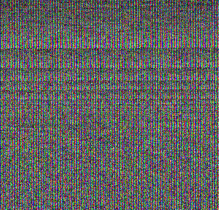

# apriltag-data-to-png

PNG data representation of the [AprilTag](https://github.com/AprilRobotics/apriltag) 52h13 table.



What 52 and 13 mean:

- **52** = number of data bits per tag (the interior bit pattern)
- **13** = minimum Hamming distance between any two valid code words (error-correction property)
- Together they name the family: `tagStandard52h13`

## Compression

Converts `vendor/tagStandard52h13.c.txt` (48714 `uint64` tag codes) into a 368×353 RGB PNG.
Raw bytes packed sequentially across RGB channels; entries span pixel boundaries.
48714 × 8 = 389712 bytes ÷ 3 = 129904 pixels = 368×353 (exact fit, no padding).

| Format | Size |
|--------|------|
| `.c` source | 1.2 MB |
| raw binary | 390 KB |
| `.png` (DEFLATE) | 359 KB |

```
bun index.js
```

## Browser access

Cuttle project for demos.folk with component for all 48714 April Tags, 52h13 standard: 
* Source: https://cuttle.xyz/@forresto/demos-folk-zine-april-tags-BeOEmDEsSzgt 
* PDF: [demos.folk zine april tags - a4.pdf](<../pdf/demos.folk zine april tags - a4.pdf>)

``` js
async function loadCodes(url) {
  const img = new Image();
  img.src = url;
  await img.decode();
  const { width, height } = img;
  const canvas = new OffscreenCanvas(width, height);
  const ctx = canvas.getContext('2d');
  ctx.drawImage(img, 0, 0);
  const { data } = ctx.getImageData(0, 0, width, height); // RGBA

  const coordinates = [
    [-2,-2],[-1,-2],[0,-2],[1,-2],[2,-2],[3,-2],[4,-2],[5,-2],
    [6,-2],[1,1],[2,1],[3,1],[2,2],[7,-2],[7,-1],[7,0],[7,1],
    [7,2],[7,3],[7,4],[7,5],[7,6],[4,1],[4,2],[4,3],[3,2],
    [7,7],[6,7],[5,7],[4,7],[3,7],[2,7],[1,7],[0,7],[-1,7],
    [4,4],[3,4],[2,4],[3,3],[-2,7],[-2,6],[-2,5],[-2,4],[-2,3],
    [-2,2],[-2,1],[-2,0],[-2,-1],[1,4],[1,3],[1,2],[2,3],
  ];

  function getCode(index) {
    let val = 0;
    for (let b = 0; b < 8; b++) {
      const pos = index * 8 + b;
      const pixel = Math.floor(pos / 3);
      const channel = pos % 3; // 0=R, 1=G, 2=B
      val = val * 256 + data[pixel * 4 + channel];
    }
    return val;
  }

  function getTagGrid(index) {
    const val = getCode(index);
    const gridSize = 10;
    const widthAtBorder = 6;
    const borderStart = 2; // (gridSize - widthAtBorder) / 2
    const nBits = 52;

    const cells = Array.from({ length: gridSize }, () => Array(gridSize).fill(true));

    for (let i = 0; i < widthAtBorder; i++) {
      cells[borderStart][borderStart + i] = false;
      cells[borderStart + widthAtBorder - 1][borderStart + i] = false;
      cells[borderStart + i][borderStart] = false;
      cells[borderStart + i][borderStart + widthAtBorder - 1] = false;
    }

    const bits = val.toString(2).padStart(nBits, '0');
    for (let i = 0; i < nBits; i++) {
      if (bits[i] === '1') {
        cells[coordinates[i][1] + borderStart][coordinates[i][0] + borderStart] = false;
      }
    }

    return cells;
  }

  return getTagGrid;
}
```
